# Message Notification Flow

```mermaid
flowchart TD
    subgraph Message Notification
        A[Google Pub/Sub] -->|Message Notification| B[Pod Server]
        B -->|Receive Message| C[Parse & Validate Data]
        C -->|Validated| D{Check Message Type}
        D -->|Different Categories| E[Find User IDs from Server Cache]
        E -->|User IDs Collected| F{Check Server Cache}
        F -->|Cache Hit| H{Is User Online?}
        F -->|Cache Miss| G[Get Message from Redis]
        G -->|Message Retrieved| H
        H -->|Yes| I[Push via WebSocket]
        I -->|Message Pushed| X[Publish Exposure Event]
        H -->|No| J{Check isOnlineOnly}
        J -->|isOnlineOnly=false| K[Batch Pool]
        K -->|Async Write| L[(Redis List Storage)]
        J -->|isOnlineOnly=true| M[Discard Message]
    end

    subgraph Exposure Logging
        N[Exposure Pub/Sub] -->|Subscribe| O[Log Consumer]
        O -->|Process Event| P[Parse Exposure Data]
        P -->|Store| Q[(Log Storage)]
    end
    
    style A fill:#E8F5E9,color:#000
    style B fill:#FFF3E0,color:#000
    style C fill:#FFF3E0,color:#000
    style D fill:#FCE4EC,color:#000
    style E fill:#E3F2FD,color:#000
    style F fill:#FCE4EC,color:#000
    style G fill:#FFF3E0,color:#000
    style H fill:#FCE4EC,color:#000
    style I fill:#E8F5E9,color:#000
    style J fill:#FCE4EC,color:#000
    style K fill:#FFF3E0,color:#000
    style L fill:#E3F2FD,color:#000
    style M fill:#FFF3E0,color:#000
    style N fill:#E8F5E9,color:#000
    style O fill:#FFF3E0,color:#000
    style P fill:#FFF3E0,color:#000
    style Q fill:#E3F2FD,color:#000
    style X fill:#E8F5E9,color:#000

classDef decision fill:#FCE4EC,stroke:#333,stroke-width:2px,color:#000;
classDef process fill:#FFF3E0,stroke:#333,stroke-width:2px,color:#000;
classDef storage fill:#E3F2FD,stroke:#333,stroke-width:2px,color:#000;
classDef io fill:#E8F5E9,stroke:#333,stroke-width:2px,color:#000;
```

# 訊息通知流程 (中文版本)

```mermaid
flowchart TD
    subgraph 訊息通知
        A[Google Pub/Sub] -->|訊息通知| B[Pod 伺服器]
        B -->|接收訊息| C[解析與驗證資料]
        C -->|驗證通過| D{檢查訊息類型}
        D -->|不同分類| E[從伺服器快取查找使用者ID]
        E -->|使用者ID已收集| F{檢查伺服器快取}
        F -->|快取命中| H{使用者在線?}
        F -->|快取未命中| G[從Redis取得訊息]
        G -->|訊息已取得| H
        H -->|是| I[透過WebSocket推送]
        I -->|訊息已推送| X[發布曝光事件]
        H -->|否| J{檢查isOnlineOnly}
        J -->|isOnlineOnly=false| K[批次處理池]
        K -->|非同步寫入| L[(Redis List儲存)]
        J -->|isOnlineOnly=true| M[丟棄訊息]
    end

    subgraph 曝光記錄
        N[曝光 Pub/Sub] -->|訂閱| O[記錄消費者]
        O -->|處理事件| P[解析曝光資料]
        P -->|儲存| Q[(記錄儲存)]
    end
    
    style A fill:#E8F5E9,color:#000
    style B fill:#FFF3E0,color:#000
    style C fill:#FFF3E0,color:#000
    style D fill:#FCE4EC,color:#000
    style E fill:#E3F2FD,color:#000
    style F fill:#FCE4EC,color:#000
    style G fill:#FFF3E0,color:#000
    style H fill:#FCE4EC,color:#000
    style I fill:#E8F5E9,color:#000
    style J fill:#FCE4EC,color:#000
    style K fill:#FFF3E0,color:#000
    style L fill:#E3F2FD,color:#000
    style M fill:#FFF3E0,color:#000
    style N fill:#E8F5E9,color:#000
    style O fill:#FFF3E0,color:#000
    style P fill:#FFF3E0,color:#000
    style Q fill:#E3F2FD,color:#000
    style X fill:#E8F5E9,color:#000

classDef decision fill:#FCE4EC,stroke:#333,stroke-width:2px,color:#000;
classDef process fill:#FFF3E0,stroke:#333,stroke-width:2px,color:#000;
classDef storage fill:#E3F2FD,stroke:#333,stroke-width:2px,color:#000;
classDef io fill:#E8F5E9,stroke:#333,stroke-width:2px,color:#000;
```

## Flow Description

1. **Message Receipt**
   - Data originates from Google Pub/Sub
   - Pod server creates a single subscription to receive messages

2. **Message Processing**
   - Received messages are parsed and validated
   - Message type is checked to determine the category

3. **User Identification**
   - System finds user IDs from server cache based on message category
   - Different categories may require different user ID lookup processes

4. **Content Retrieval**
   - System first checks server cache for message content
   - If cache miss occurs, content is fetched from Redis
   - Retrieved content is used for message delivery

5. **Message Delivery**
   - Online users receive messages via WebSocket
   - After successful delivery, exposure event is published
   - For offline users:
     - If isOnlineOnly=false: Messages are stored in Redis List
     - If isOnlineOnly=true: Messages are discarded

6. **Offline Storage**
   - Messages for offline users are processed through a batch pool
   - Batch pool performs asynchronous writes to Redis
   - Fixed batch size or time interval determines write frequency

7. **Exposure Logging**
   - Exposure events are published to dedicated Pub/Sub topic
   - Log consumer processes exposure events
   - Events are parsed and stored in log storage

## 流程說明

1. **訊息接收**
   - 資料來源為 Google Pub/Sub
   - Pod 伺服器建立單一訂閱以接收訊息

2. **訊息處理**
   - 接收到的訊息進行解析和驗證
   - 檢查訊息類型以確定分類

3. **使用者識別**
   - 系統根據訊息分類從伺服器快取中查找使用者ID
   - 不同分類可能需要不同的使用者ID查找流程

4. **內容獲取**
   - 系統首先檢查伺服器快取中的訊息內容
   - 如遇快取未命中，則從Redis獲取內容
   - 獲取的內容用於訊息投遞

5. **訊息投遞**
   - 在線使用者透過WebSocket接收訊息
   - 成功投遞後，發布曝光事件
   - 離線使用者處理：
     - 若isOnlineOnly=false：訊息儲存到Redis List
     - 若isOnlineOnly=true：訊息被丟棄

6. **離線儲存**
   - 離線使用者的訊息透過批次處理池處理
   - 批次處理池執行非同步寫入Redis
   - 寫入頻率由固定批次大小或時間間隔決定

7. **曝光記錄**
   - 曝光事件發布到專用Pub/Sub主題
   - 記錄消費者處理曝光事件
   - 事件經解析後儲存到記錄儲存中
