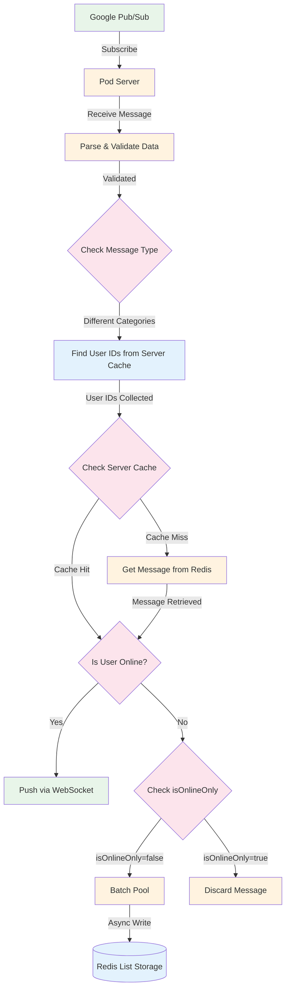

# Message Notification Flow

## Flow Description

1. **Message Receipt**
   - Data originates from Google Pub/Sub
   - Pod server creates a single subscription to receive messages

2. **Message Processing**
   - Received messages are parsed and validated
   - Message type is checked to determine the category

3. **User Identification**
   - System finds user IDs from server cache based on message category
   - Different categories may require different user ID lookup processes

4. **Content Retrieval**
   - System first checks server cache for message content
   - If cache miss occurs, content is fetched from Redis
   - Retrieved content is used for message delivery

5. **Message Delivery**
   - Online users receive messages via WebSocket
   - For offline users:
     - If isOnlineOnly=false: Messages are stored in Redis List
     - If isOnlineOnly=true: Messages are discarded

6. **Offline Storage**
   - Messages for offline users are processed through a batch pool
   - Batch pool performs asynchronous writes to Redis
   - Fixed batch size or time interval determines write frequency
