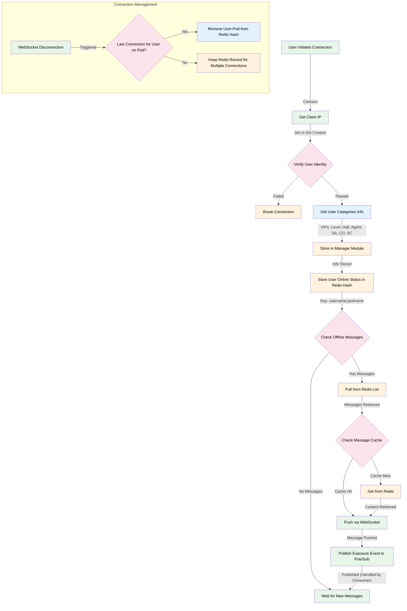
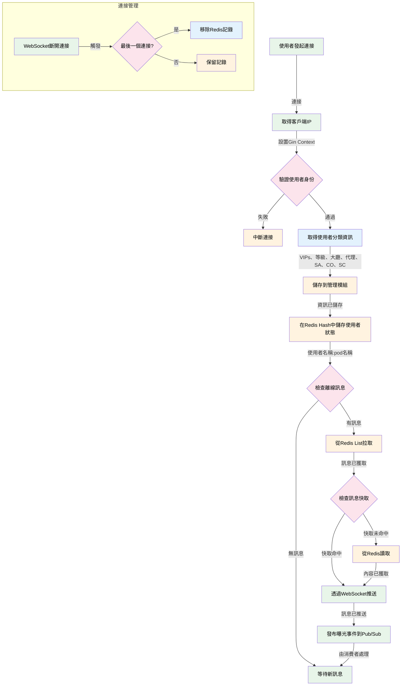

# WebSocket Connection Flow

# WebSocket 連接流程圖 (中文版本)

## Flow Description

1. **WebSocket Connection**
   - User initiates WebSocket connection
   - Get Client IP and set value into gin's Context.Keys
2. **User Messaging**
   - System verifies user identity
   - Failed verification leads to connection rejection 
3. **User Categories Setup**
   - System retrieves all categories information for the user (VIPs, Levele, Hall , Agent, SA, CO, SC )
   - Information is stored in the manager module for session management

4. **User Online Status**
   - System stores user online status in Redis hash
   - Uses composite key of username:podname
   - Maintains one record per user per pod regardless of connection count

5. **Offline Message Check**
   - System checks for any pending offline messages
   - If messages exist, they are pulled from Redis List storage
   - If no messages, system waits for new incoming messages

6. **Message Content Retrieval**
   - System first checks message cache for content
   - On cache miss, content is fetched from Redis
   - Retrieved message is prepared for delivery

7. **Message Delivery**
   - Messages are pushed to user via WebSocket connection
   - System publishes exposure event to Google Pub/Sub for tracking
   - Exposure logs are handled by separate consumer process

8. **Connection Management**
   - System tracks WebSocket disconnections
   - Checks if it's the last connection for user on pod
   - Removes user:pod record from Redis only when last connection closes
   - Maintains efficient online user tracking per pod

## 流程說明

1. **WebSocket連接**
   - 使用者發起WebSocket連接
   - 取得客戶端IP並設置到gin的Context.Keys中

2. **使用者驗證**
   - 系統驗證使用者身份
   - 驗證失敗則中斷連接

3. **使用者分類設置**
   - 系統取得使用者的所有分類資訊（VIP、等級、大廳、代理、SA、CO、SC）
   - 資訊儲存到管理模組中用於會話管理

4. **使用者在線狀態**
   - 系統在Redis hash中儲存使用者在線狀態
   - 使用複合鍵值：使用者名稱:pod名稱
   - 每個pod上的每個使用者只維護一條記錄，不論連接數量

5. **離線訊息檢查**
   - 系統檢查是否有待處理的離線訊息
   - 如果存在訊息，從Redis List中拉取
   - 如果沒有訊息，系統等待新訊息

6. **訊息內容取得**
   - 系統首先檢查訊息快取
   - 快取未命中時從Redis取得內容
   - 準備訊息用於投遞

7. **訊息投遞**
   - 透過WebSocket連接推送訊息給使用者
   - 系統向Google Pub/Sub發布曝光事件用於追蹤
   - 曝光日誌由獨立的消費者程序處理

8. **連接管理**
   - 系統追蹤WebSocket中斷連接
   - 檢查是否是使用者在pod上的最後一個連接
   - 僅在最後一個連接關閉時從Redis中移除使用者:pod記錄
   - 維護高效的在線使用者追蹤機制
