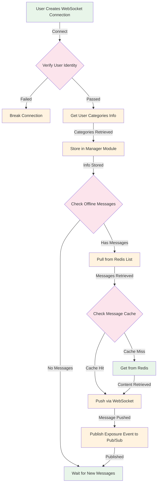

# WebSocket Connection Flow

## Flow Description

1. **WebSocket Connection**
   - User initiates WebSocket connection
   - System verifies user identity
   - Failed verification leads to connection rejection

2. **User Categories Setup**
   - System retrieves all categories information for the user
   - Information is stored in the manager module for session management

3. **Offline Message Check**
   - System checks for any pending offline messages
   - If messages exist, they are pulled from Redis List storage
   - If no messages, system waits for new incoming messages

4. **Message Content Retrieval**
   - System first checks message cache for content
   - On cache miss, content is fetched from Redis
   - Retrieved message is prepared for delivery

5. **Message Delivery**
   - Messages are pushed to user via WebSocket connection
   - System publishes exposure event to Google Pub/Sub for tracking
   - Exposure logs are handled by separate consumer process
